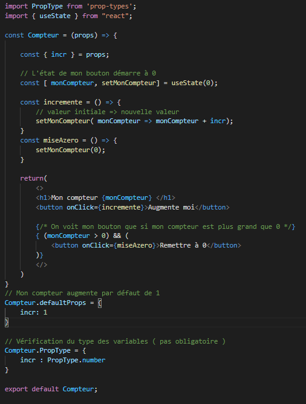
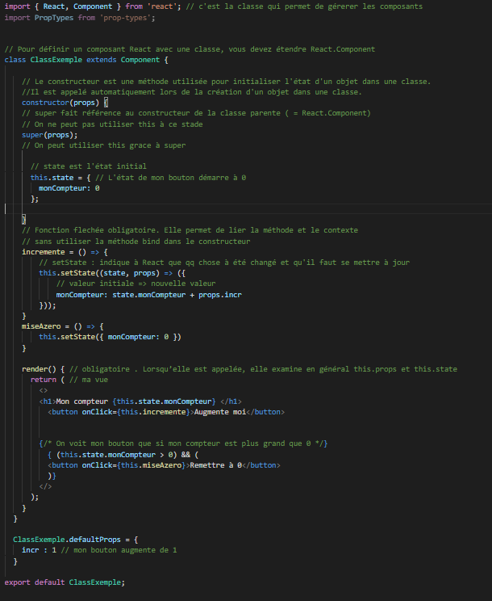

# Compteur version Hook

```jsx
import PropType from 'prop-types';
import { useState } from "react";

const Compteur = (props) => {

    const { incr } = props;

    const [ monCompteur, setMonCompteur] = useState(0);

    const incremente = () => {
        // valeur initiale => nouvelle valeur
        setMonCompteur( monCompteur => monCompteur + incr);
      //  setVisible
    }
    const miseAzero = () => {
        setMonCompteur(0);
    }

    return(
        <>
        <h1>Mon compteur {monCompteur} </h1>
        <button onClick={incremente}>Augmente moi</button>
        
        {/* On voit mon bouton que si mon compteur est plus grand que 0 */}
        { (monCompteur > 0) && (
            <button onClick={miseAzero}>Remettre à 0</button>
        )}
        </>
    )
}
// Mon compteur augmente par défaut de 1
Compteur.defaultProps = {
    incr: 1
}

// Vérification du type des variables ( pas obligatoire )
Compteur.PropType = {
    incr : PropType.number
}

export default Compteur;
```

# Compteur version Class 

```js
// import React from 'react'; 
import { Component, React } from 'react'; // c'est la classe qui permet de gérerer les composants


// Pour définir un composant React avec une classe, vous devez étendre Component
class ClassExemple extends Component {

    // Le constructeur est une méthode utilisée pour initialiser l'état d'un objet dans une classe. 
    //Il est appelé automatiquement lors de la création d'un objet dans une classe.
    constructor(props) {
    // super fait référence au constructeur de la classe parente ( = React.Component)
    // On ne peut pas utiliser this à ce stade
    super(props);
    // On peut utiliser this grace à super  

      // state est l'état initial
      this.state = { // L'état de mon bouton démarre à 0
        monCompteur: 0 
      };

    }
    // Fonction flechée obligatoire. Elle permet de lier la méthode et le contexte
    // sans utiliser la méthode bind dans le constructeur
    incremente = () => {
        // setState : indique à React que qq chose à été changé et qu'il faut se mettre à jour
        this.setState(state, props) => ({
            // valeur initiale => nouvelle valeur
            monCompteur: state.monCompteur + props.incr
        }));
    }
    miseAzero = () => {
        this.setState({ monCompteur: 0 })
    }
  
    render() { // obligatoire . Lorsqu’elle est appelée, elle examine en général this.props et this.state
      return ( // ma vue
        <>
        <h1>Mon compteur {this.state.monCompteur} </h1>
          <button onClick={this.incremente}>Augmente moi</button>

          
        {/* On voit mon bouton que si mon compteur est plus grand que 0 */}
          { (this.state.monCompteur > 0) && (
          <button onClick={this.miseAzero}>Remettre à 0</button>
          )}
        </>
      );
    }
  }

  ClassExemple.defaultProps = {
    incr : 1 // mon bouton augmente de 1
  }

export default ClassExemple;

```